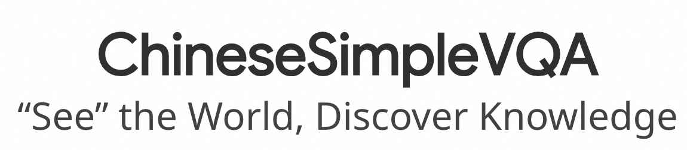
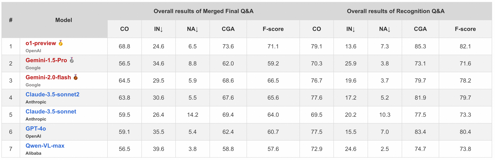

# Overview


<p align="center">
  
</p>
<p align="center">
   🌐 <a href="https://chinesesimplevqa.github.io/ChieseSimpleVQA.github.io/#leaderboard" target="_blank">Website</a> • 🤗 <a href="https://huggingface.co/datasets/OpenStellarTeam/Chinese-SimpleVQA" target="_blank">Hugging Face</a> • ⏬ <a href="#data" target="_blank">Data</a> •   📃 <a href="https://arxiv.org/pdf/2502.11718" target="_blank">Paper</a><br>  <a href="https://github.com/OpenStellarTeam/ChineseSimpleVQA/blob/master/README_zh.md">   中文</a> | <a href="https://github.com/OpenStellarTeam/ChineseSimpleVQA/blob/master/README.md">English 
</p> 


**Chinese SimpleVQA** is the first factuality-based visual question-answering benchmark in Chinese, aimed at assessing the visual factuality of LVLMs across 8 major topics and 56 subtopics. The key features of this benchmark include a focus on the **Chinese** language, **diverse** knowledge types, a **multi-hop** question construction, **high-quality** data, **static** consistency, and **easy-to-evaluate** through short answers. 

 Please visit our [website](https://chinesesimplevqa.github.io/ChieseSimpleVQA.github.io/#leaderboard/) or check our [paper](https://arxiv.org/pdf/2502.11718) for more details. 

> This is the evaluation repository for Chinese SimpleVQA, and it follows the MIT License.

<p align="center">
  
</p>

## 💫 Introduction

* To comprehensively assess the factual knowledge of LVLMs, we present a **ChineseSimpleVQA** benchmark, which consists of a dataset containing 2,200 high-quality questions across 56 topics, spanning from the humanities to science and engineering. Specifically, the key distinguishing features of our proposed ChineseSimpleVQA are as follows:
  * **Multi-hop:** Visual factuality inquiries are decomposed into two steps: object recognition and knowledge assessment. This multi-hop strategy allows us to analyze the capability boundaries and execution mechanisms of LVLMs.
  * 🍀**Diverse:** ChineseSimpleVQA emphasizes the Chinese language and covers 8 major topics (i.e., ``Nature, Sciences, Engineering, Humanities & Society, modern Architecture, Ancient Architecture, Geography Meteorological ``and ``Life Culture & Art``). These topics encompass 56 fine-grained subtopics.
  * ⚡**High-quality:** We implement a rigorous pipeline for the benchmark construction, including automatic verification, difficulty filtering, and human verification.
  * 💡**Static:** To maintain the enduring quality of ChineseSimpleVQA, all reference answers will remain unchanged over time.
  * 🗂️**Easy-to-evaluate:** All of the questions and answers are in a short format for quick evaluation.

- Based on Chinese SimpleVQA, we have conducted a comprehensive evaluation of the factual capabilities of existing 34 LVLMs. We also maintain a comprehensive leaderboard list. 


## 📊 Leaderboard

<p align="center">
  
</p>


## 🛠️ Setup

For the [OpenAI API](https://pypi.org/project/openai/):

```bash
pip install openai
```

For datasets, we provide two version, you can either use the datasets with url image in `/data/ChineseSimpleVQA.jsonl` or download the datasets.


## ⚖️ Evals

We provide a simple single evaluation script that we wrote from scratch.  The startup command is as follows: 

(1): For closedsource LVLMs:

- Step1: set your openai key in judge/closedsource_eval.py or judge/oepnsource_eval.py:

  ```
  os.environ["OPENAI_API_KEY"] = "replace your key here"
  os.environ["OPENAI_BASE_URL"] = "replace your key here"
  ```

- Step2: run the eval script:

    (1): For closedsource LVLMs:

  ```
  python judge/closedsource_eval.py <model_name>. 
  ```
   (2): For oepnsource LVLMs:
  ```
  python judge/oepnsource_eval.py <model_name>. 
  ```
  the structure of input data should be transfered like this format with model_output:
  ```
  {"ID": "...", 
  "image_url": "...", 
  "recognition_question": "...", 
  "recognition_answer": "...", 
  "final_question": "...", 
  "final_answer": "...", 
  "Topic": "...", 
  "model_output1": "...", 
  "model_output2": "..."
  }
  ```


## Citation

Please cite our paper if you use our dataset.

```
@article{gu2025see,
  title={" See the World, Discover Knowledge": A Chinese Factuality Evaluation for Large Vision Language Models},
  author={Gu, Jihao and Wang, Yingyao and Bu, Pi and Wang, Chen and Wang, Ziming and Song, Tengtao and Wei, Donglai and Yuan, Jiale and Zhao, Yingxiu and He, Yancheng and others},
  journal={arXiv preprint arXiv:2502.11718},
  year={2025}
}
```