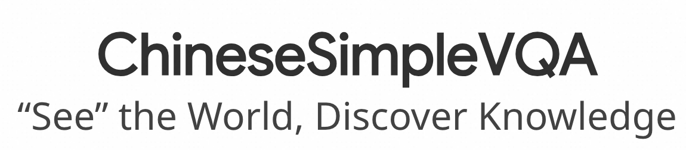
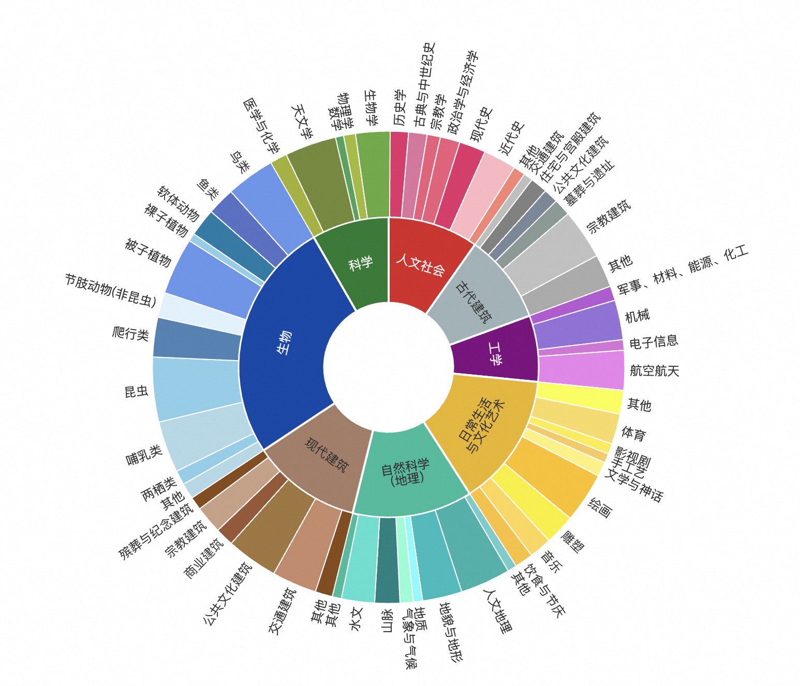
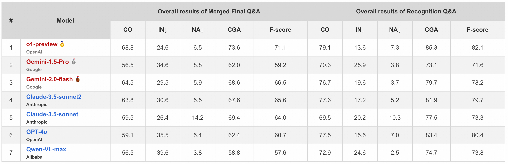

# Overview


<p align="center">
  
</p>
<p align="center">
   🌐 <a href="https://chinesesimplevqa.github.io/ChieseSimpleVQA.github.io/#leaderboard" target="_blank">Website</a> • 🤗 <a href="https://huggingface.co/datasets/OpenStellarTeam/Chinese-SimpleVQA" target="_blank">Hugging Face</a> • ⏬ <a href="#data" target="_blank">Data</a> •   📃 <a href="https://arxiv.org/pdf/2502.11718" target="_blank">Paper</a><br>  <a href="https://github.com/OpenStellarTeam/ChineseSimpleVQA/blob/master/README_zh.md">   中文</a> | <a href="https://github.com/OpenStellarTeam/ChineseSimpleVQA/blob/master/README.md">English 
</p> 


ChineseSimpleVQA是首个面向事实知识的中文视觉问答基准。这是第一个系统性地衡量大型视觉语言模型事实准确性的中文评测集，可以全面探测模型在各个领域的视觉识别能力和知识水平。
 请参考 [网站](https://chinesesimplevqa.github.io/ChieseSimpleVQA.github.io/#leaderboard) 或者我们的 [文章](https://arxiv.org/pdf/2502.11718) 来获取更多细节. 

<p align="center">
  
</p>

## 💫 Introduction

* ChineseSimpleVQA旨在评估大型视觉语言模型（LVLMs）的视觉事实性，该基准测试包含2,200个高质量问题，覆盖了8个主要话题和56个子话题，这些问题涉及从人文到科学和工程等多个领域。
具体来说，Chinese SimpleVQA 主要有五个特点：
  * 多跳评估： 解耦视觉模型知识能力评估步骤，包括图片主体识别和知识评估。这种多跳评估策略让使用者可以深入分析大型视觉语言模型（LVLMs）的能力边界和执行机制。
  * 多样性： 评测集共有2200条高质量问答对，涵盖了8个知识类别及56个细分主题，包括“自然”、“科学”、“工程技术”、“人文社会”、“生活、文化与艺术”等。
  * 高质量： ChineseSimpleVQA 拥有严格的构建流程，包括自动验证、难度筛选和人工验证。共有23位标注同学和6位算法同学进行质量把控，以及6位安全审查员进行数据风险审查。
  * 静态一致性：ChineseSimpleVQA 具有持久可用性，所有的参考答案将不随时间而发生改变。
  * 易于评估： 所有问题和答案均采用简短格式，方便快速评估。此外，ChineseSimpleVQA 提供一键评测脚本以协助研究人员开展工作。

- 基于 Chinese SimpleVQA, 该工作中提供了对 13 个闭源模型和 21 个开源模型的全面评测和分析. 


## 📊 Leaderboard

<p align="center">
  
</p>


## 🛠️ Setup

对于 [OpenAI API](https://pypi.org/project/openai/):

```bash
pip install openai
```

对于数据集, 我们提供了两个版本, 你既可以使用本代码文件当中的ulr形式的图片`/data/ChineseSimpleVQA.jsonl` 也可以下载数据到本地


## ⚖️ Evals

我们提供了一个简单的评测脚本，推理步骤如下：

- 步骤1: 在judge/closedsource_eval.py或judge/oepnsource_eval.py设置openai key:

  ```
  os.environ["OPENAI_API_KEY"] = "replace your key here"
  os.environ["OPENAI_BASE_URL"] = "replace your key here"
  ```

- 步骤2: 测试:

    (1): 对于闭源模型:

  ```
  python judge/closedsource_eval.py <model_name>. 
  ```
   (2): 对于开源模型:
  ```
  python judge/oepnsource_eval.py <model_name>. 
  ```
  输入的数据必须是具有model_output的以下格式:
  ```
  {"ID": "...", 
  "image_url": "...", 
  "recognition_question": "...", 
  "recognition_answer": "...", 
  "final_question": "...", 
  "final_answer": "...", 
  "Topic": "...", 
  "model_output1": "...", 
  "model_output2": "..."
  }
  ```


## Citation

如果您使用了我们的数据集，请引用我们的论文。

```
@article{gu2025see,
  title={" See the World, Discover Knowledge": A Chinese Factuality Evaluation for Large Vision Language Models},
  author={Gu, Jihao and Wang, Yingyao and Bu, Pi and Wang, Chen and Wang, Ziming and Song, Tengtao and Wei, Donglai and Yuan, Jiale and Zhao, Yingxiu and He, Yancheng and others},
  journal={arXiv preprint arXiv:2502.11718},
  year={2025}
}
```